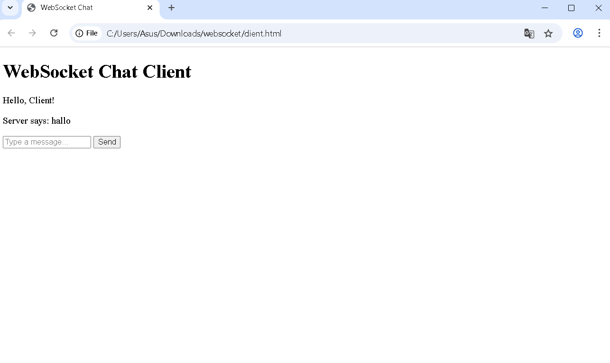

|Nama|NIM|Kelas|Mata Kuliah|
|----|---|-----|------|
|**Fajar Julianwar**|**312310672**|**TI.23.A6**|**Pemrograman Web 2**|
|**Link Medium    **| https://medium.com/@fajarjulianwar/websocket-membangun-aplikasi-chat-real-time-a35b6c76f9ed | 

# WebSocket Chat Real-Time Sederhana
### Aplikasi chat real-time sederhana berbasis WebSocket yang memungkinkan komunikasi dua arah secara langsung antara server dan klien. Pesan yang dikirimkan oleh satu klien akan diterima oleh semua klien yang terhubung dalam waktu nyata.

## Persiapan Lingkungan Pengembangan
### Sebelum memulai, pastikan Anda sudah menginstal Node.js di komputer Anda. Jika belum, unduh dan pasang Node.js dari situs resmi Node.js.

## 1. Membuat Server WebSocket
### Untuk membuat server WebSocket, kita akan menggunakan library ws yang tersedia di Node.js. Berikut adalah cara membuat server WebSocket yang sederhana:

### server.js
```
const WebSocket = require("ws");

// Membuat server WebSocket
const wss = new WebSocket.Server({ port: 8080 });

// Menangani koneksi dari client
wss.on("connection", (ws) => {
  console.log("A user connected");

  // Mengirim pesan ke client setiap kali ada pesan baru
  ws.on("message", (message) => {
    console.log("received: %s", message); // Mencatat pesan yang diterima
    wss.clients.forEach((client) => {
      if (client !== ws && client.readyState === WebSocket.OPEN) {
        // Kirim pesan ke semua client kecuali pengirim
        client.send(message);
      }
    });
  });

  ws.on("close", () => {
    console.log("A user disconnected");
  });
});

console.log("WebSocket server is running on ws://localhost:8080");
```

### Penjelasan:

• Kami menggunakan library ws untuk membuat server WebSocket yang berjalan di port 8080.

• Setiap kali ada koneksi dari client, server akan menerima pesan dan mengirimkannya ke semua klien yang terhubung.

• Jika client terputus, server akan mencatatnya di log.


## 2. Membuat Client WebSocket
### Untuk membuat client yang terhubung ke server WebSocket, kita akan menggunakan HTML dan JavaScript. Klien akan mengirim dan menerima pesan dari server secara real-time.
### index.html
```
<!DOCTYPE html>
<html lang="en">
<head>
    <meta charset="UTF-8">
    <meta name="viewport" content="width=device-width, initial-scale=1.0">
    <title>WebSocket Real-Time Chat</title>
</head>
<body>
    <h1>Real-Time Chat</h1>
    <div id="messages"></div>
    <input id="inputMessage" type="text" placeholder="Type a message..." />
    <button onclick="sendMessage()">Send</button>

    <script>
        const socket = new WebSocket('ws://localhost:8080');

        socket.onopen = () => {
            console.log('Connected to WebSocket server');
        };

        socket.onmessage = (event) => {
            const messagesDiv = document.getElementById('messages');
            const message = document.createElement('div');
            message.textContent = event.data; // Menampilkan pesan yang diterima
            messagesDiv.appendChild(message);
        };

        socket.onclose = () => {
            console.log('Disconnected from WebSocket server');
        };

        function sendMessage() {
            const message = document.getElementById('inputMessage').value;
            socket.send(message); // Mengirim pesan ke server
            document.getElementById('inputMessage').value = ''; // Menghapus input
        }
    </script>
</body>
</html>
```

### Penjelasan:

• WebSocket('ws://localhost:8080'): Membuka koneksi ke server WebSocket yang berjalan di ws://localhost:8080..

• onmessage: Fungsi ini menangani pesan yang diterima dari server dan menampilkannya di halaman web.

• sendMessage(): Fungsi ini mengirimkan pesan yang ditulis oleh pengguna ke server, kemudian membersihkan kolom input setelah pesan terkirim.


## 3. Menjalankan Aplikasi
### 1. Buat file server.js dan index.html di direktori yang sama.
### 2. Jalankan server WebSocket dengan perintah:
```
bash
node server.js
```
### • Buka file index.html di browser. Kamu akan melihat pesan real-time yang diterima dari server setiap kali ada pesan baru dari klien lain.

# Output



